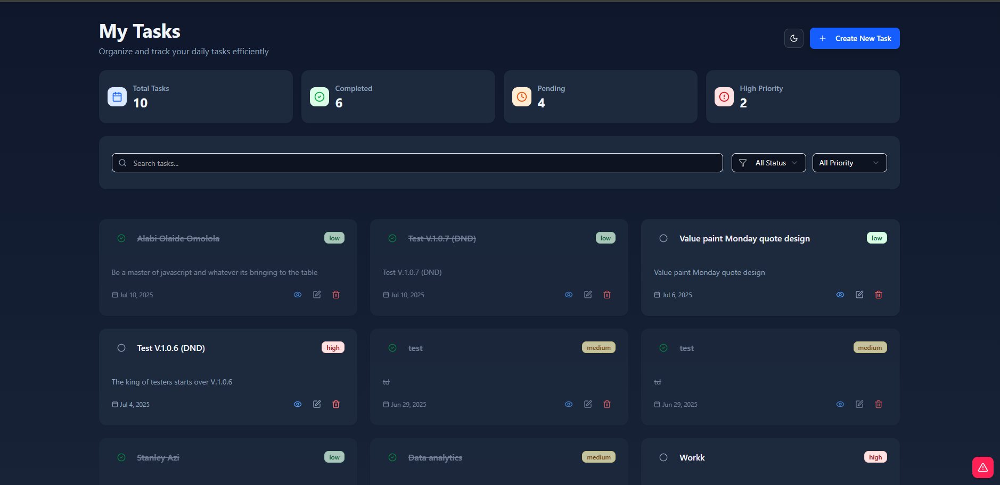

# 📝 My Task: Modern Todo Manager

[](https://vitejs.dev/)
[](https://react.dev/)
[](https://tailwindcss.com/)
[](https://ui.shadcn.com/)

**My Task** is a modern and responsive todo application that helps users organize and track tasks efficiently. Built with a focus on simplicity and performance, the app provides a seamless user experience across devices.



## 📚 Table of Contents

- [🚀 Features](#features)
- [📦 Installation & Setup](#installation--setup)
- [🧪 Available Scripts](#available-scripts)
- [🛠 Tech Stack](#tech-stack)
- [📡 API Documentation & Usage](#api-documentation--usage)
- [🖼 Media](#media)
- [⚠️ Known Issues](#known-issues)
- [🔮 Future Improvements](#future-improvements)
- [🔗 Live Demo](#live-demo)

## Features

- **✅ CRUD Operations**
  - Create, update, delete tasks with form validation
  - Toggle task status: complete ↔ in-progress (with strikethrough for completed)
- **🎯 Filtering & Search**
  - Filter tasks by status (PENDING, COMPLETED) and priority (LOW, MEDIUM, HIGH)
  - Debounced search by title
- **📊 Pagination**
  - Paginate through task list for better performance
- **🎨 UI & UX**
  - Responsive design (mobile-friendly)
  - Light/dark mode toggle
  - Skeleton loaders for seamless experience
- **📄 Task Details**
  - View full task information including description, priority, and timestamps
- **⚡ Optimized State**
  - React Query for efficient data fetching/caching
  - Debounced search inputs
- **🏗 Tooling**
  - Fast builds with Vite, styled with Tailwind + Shadcn UI
  - Type-safe forms with react-hook-form + Zod
- **🧭 Error & Routing**

  - Fallback UI using Error Boundaries
  - Custom 404 page for undefined routes

## Installation & Setup

1. **Clone the repository**

```bash
git clone https://github.com/holayide/todo-project-altsch
```

2. **Install dependencies**

```bash
pnpm install
```

3. **Run the app**

```bash
pnpm run dev
```

4. Open `http://localhost:5173` in your browser.

## Available Scripts

- `pnpm run dev` – Start the development server

- `pnpm run build` – Build the app for production

- `pnpm run preview` – Preview the built app

## Tech Stack

| Category     | Technologies                                                   |
| ------------ | -------------------------------------------------------------- |
| **Frontend** | React 19                                                       |
| **Styling**  | TailwindCSS + ShadCN UI components                             |
| **Forms**    | react-hook-form + Zod validation                               |
| **Routing**  | React Router                                                   |
| **API**      | [Oluwasetemi Tasks API](https://api.oluwasetemi.dev/reference) |
| **Tooling**  | Vite, ESLint, Prettier                                         |

## API Documentation & Usage

This project uses a public RESTful API available at:  
**🔗 [`https://api.oluwasetemi.dev/tasks`](https://api.oluwasetemi.dev/reference)**

All requests and responses are in JSON format.

### Optional Query Parameters:

| **Parameter** | **Type** | **Description**                                    |
| ------------- | -------- | -------------------------------------------------- |
| `page`        | number   | Pagination page number (default: `1`)              |
| `name`        | string   | Filter tasks by name (search by task title)        |
| `status`      | string   | Filter tasks by status (`TODO` or `DONE`)          |
| `priority`    | string   | Filter tasks by priority (`LOW`, `MEDIUM`, `HIGH`) |
| `all`         | boolean  | If `true`, returns all tasks (ignores pagination)  |

- Fetch Task by ID

```http
GET /tasks/:id
```

Returns a single task by its unique id.

- Create a Task

```http
POST /tasks
```

Create a new task.

- Update a Task

```http
PATCH /tasks/:id
```

You can update any subset of fields.

- Delete a Task

```http
DELETE /tasks/:id
```

Permanently removes a task by ID.

- Toggle Task Status

```http
PATCH /tasks/:id
```

Used to toggle a task between in-progress and completed.

## Media

🎥 [Watch Video Demo on Loom](https://www.loom.com/share/bfda9844156d4757a77d6c8b2cf3b588?sid=e7fab3fa-337d-440a-9d43-50476fd8e2c3)

## Known Issues

🟠 On edit, the priority (for medium and high) `<select>` field does not prefill.

## Future Improvements

- Drag-and-drop reordering
- User authentication
- Due dates and reminders

## Live Demo

Visit the live app here: [my-task.netlify.app](https://my-tasktastic.netlify.app/home)
